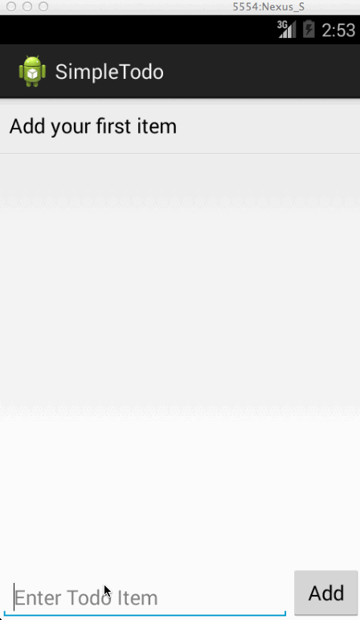

# Android Todo App

This is a basic app that allows adding and removing items into a list adapater. The list is saved to disk after every change. The list will contain a todo item "Create your first item" if the list is empty.

Time spent: < 1 hour

Completed user stories:

 * [x] Required: User can add and remove items to the list
 * [x] Required: The list is saved to disk
 * [x] Optional: Provide a default item when the list is initially empty
 
Walkthrough of all user stories:

GIF created with [LiceCap](http://www.cockos.com/licecap/).
